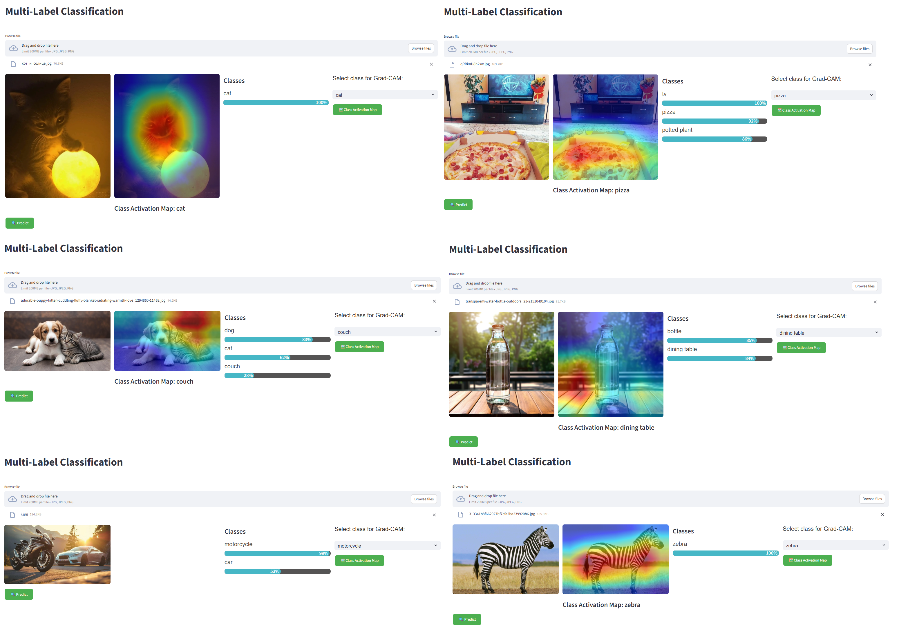
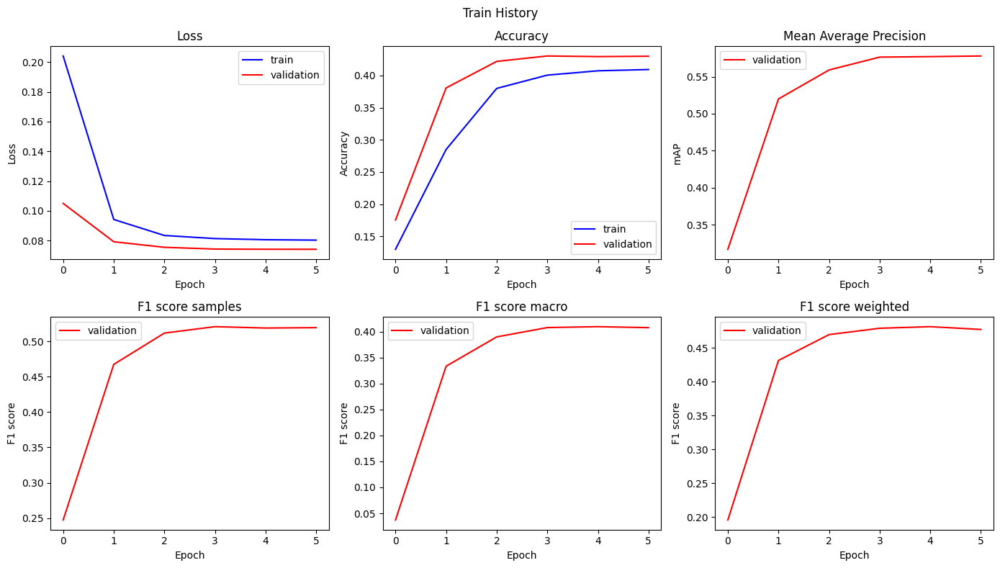
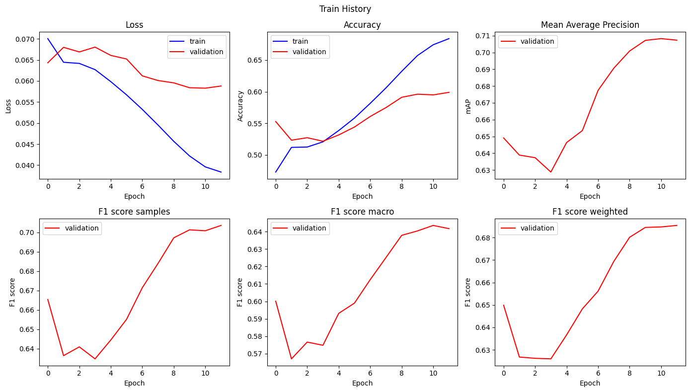
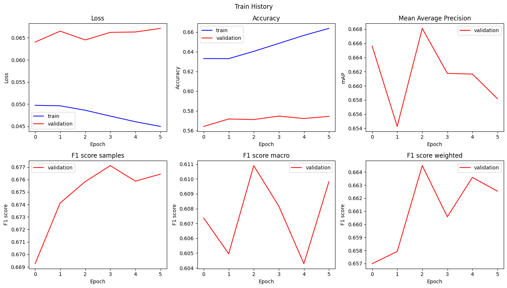

# Multi-Label Classification

>### Info
 >[The models are located on Hugging Face](https://huggingface.co/Nokish1/multi-label-cls)
 >
 >The dependencies used in this project are located in requirements.txt 
 > ```python 
 >pip install -r requirements.txt
 >```
 > To launch the interface
 > ```python 
 >streamlit run app.py
 >```
 

## 🖼️What is the repository about?

This project is a research in the field of deep learning and computer vision. I worked with multi-label classification using the pre-trained ResNet34. Streamlit was used as the interface.

## Examples of how the model works


## 🗂️Dataset

After conducting many experiments and trying out several datasets, I settled on MS COCO, which contains about 130,000 images in the Train set and 80 classification classes. Initially, the dataset was designed for object detection, which may cause issues with small objects in images and beyond.

## Model training
I trained the model in 3 steps:
1) Training the classifier (model head) - 6 epochs
2) Unfreezing the backbone parameters and fine-tuning the model - 12 epochs
3) Reducing the learning rate and disabling the scheduler and polishing the model - 6 epochs

According to the metrics, the epochs were enough for the metrics to reach a plateau and remain almost unchanged.

After testing the models, I chose the model that performed the best in the second training step.

## Metrics after testing the model:
  >- Loss: 0.057
  >- IoU (Accuracy on graphs): 0.627
  >- F1 score (samples): 0.723

## 📈Learning curves

### 1️⃣First stage
 

### 2️⃣Second stage


### 3️⃣Third stage


## Conclusions

I've put a lot of work into this project, and I've faced a few setbacks, but I've finally achieved the desired result. The model's performance is quite satisfactory. I can say that I've made good progress, considering the quality of the dataset, the model's capabilities, and the available computational resources.


